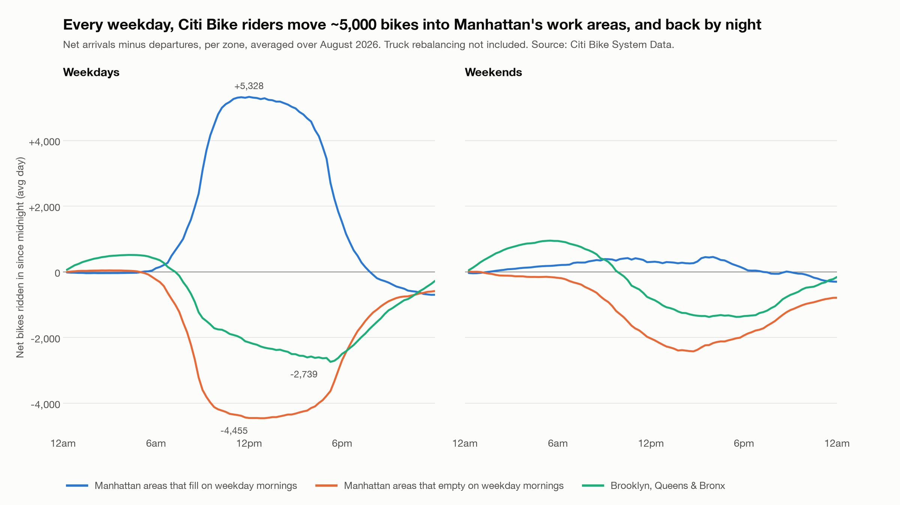

# Citi Bike Migration

Where do Citi Bikes go over a day? Station-level "migration" across NYC, from public trip data
and live snapshots of the Citi Bike feed. Plan and open decisions: [DESIGN.md](DESIGN.md).



## Reproduce the August 2026 charts

```sh
brew install duckdb
python3 -m venv .venv && .venv/bin/pip install duckdb pandas matplotlib pyarrow
mkdir -p data/raw && curl -o data/raw/202608.zip https://s3.amazonaws.com/tripdata/202608-citibike-tripdata.zip
(cd data/raw && unzip 202608.zip)
curl -L -o data/nta2020.geojson "https://data.cityofnewyork.us/api/geospatial/9nt8-h7nd?method=export&format=GeoJSON"
duckdb data/trips.duckdb -c "CREATE TABLE t AS SELECT * FROM read_csv('data/raw/*.csv')"
duckdb data/trips.duckdb < analysis/prepare.sql
.venv/bin/python analysis/tide_chart.py
```

`data/` is gitignored (about 2 GB). Charts and their CSVs go to `output/`.
